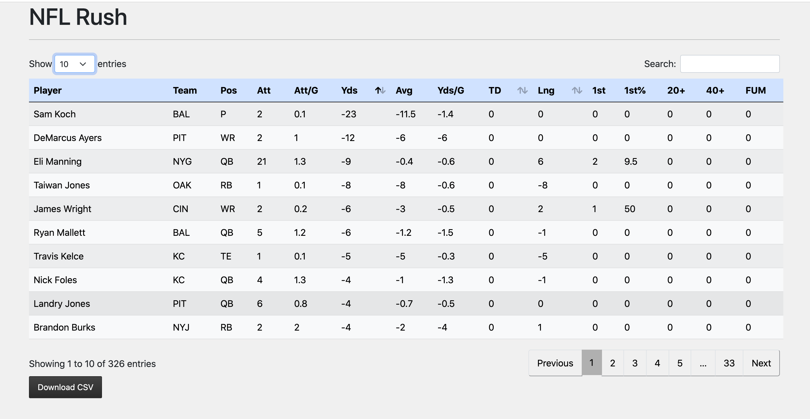

# theScore "the Rush" Interview Challenge
At theScore, we are always looking for intelligent, resourceful, full-stack developers to join our growing team. To help us evaluate new talent, we have created this take-home interview question. This question should take you no more than a few hours.

**All candidates must complete this before the possibility of an in-person interview. During the in-person interview, your submitted project will be used as the base for further extensions.**

### Why a take-home challenge?
In-person coding interviews can be stressful and can hide some people's full potential. A take-home gives you a chance work in a less stressful environment and showcase your talent.

We want you to be at your best and most comfortable.

### A bit about our tech stack
As outlined in our job description, you will come across technologies which include a server-side web framework (like Elixir/Phoenix, Ruby on Rails or a modern Javascript framework) and a front-end Javascript framework (like ReactJS)

### Challenge Background
We have sets of records representing football players' rushing statistics. All records have the following attributes:
* `Player` (Player's name)
* `Team` (Player's team abbreviation)
* `Pos` (Player's postion)
* `Att/G` (Rushing Attempts Per Game Average)
* `Att` (Rushing Attempts)
* `Yds` (Total Rushing Yards)
* `Avg` (Rushing Average Yards Per Attempt)
* `Yds/G` (Rushing Yards Per Game)
* `TD` (Total Rushing Touchdowns)
* `Lng` (Longest Rush -- a `T` represents a touchdown occurred)
* `1st` (Rushing First Downs)
* `1st%` (Rushing First Down Percentage)
* `20+` (Rushing 20+ Yards Each)
* `40+` (Rushing 40+ Yards Each)
* `FUM` (Rushing Fumbles)

In this repo is a sample data file [`rushing.json`](/rushing.json).

##### Challenge Requirements
1. Create a web app. This must be able to do the following steps
    1. Create a webpage which displays a table with the contents of [`rushing.json`](/rushing.json)
    2. The user should be able to sort the players by _Total Rushing Yards_, _Longest Rush_ and _Total Rushing Touchdowns_
    3. The user should be able to filter by the player's name
    4. The user should be able to download the sorted data as a CSV, as well as a filtered subset
    
2. The system should be able to potentially support larger sets of data on the order of 10k records.

3. Update the section `Installation and running this solution` in the README file explaining how to run your code

### Submitting a solution
1. Download this repo
2. Complete the problem outlined in the `Requirements` section
3. In your personal public GitHub repo, create a new public repo with this implementation
4. Provide this link to your contact at theScore

We will evaluate you on your ability to solve the problem defined in the requirements section as well as your choice of frameworks, and general coding style.

### Help
If you have any questions regarding requirements, do not hesitate to email your contact at theScore for clarification.

### Installation and running this solution

Installations would work with python3 or pip3 depending on version.

#### Dependencies
**Python** needs to be installed as well as **flask framework** details for this to run. I've included the requirements file and also some details on requirements and virtualenv installation below.

##### Install dependencies for flask framework 
`pip install -r requirements.txt` 

##### Install virtualenv, if needed
`pip install virtualenv`

##### Name virtualenv
`virtualenv nameofvirtualenv`

##### Activate virtualenv 
`source nameofvirtualenv/bin/activate`

#### Run app.py from nfl/ directory
`python app.py` 

The following details should be displayed after you run app.py:

#### Go to localhost link to view nfl rush table
<http://127.0.0.1:5000/>

Press CTRL+C to quit running the app

##### Deactivate virtualenv when finished
`deactivate`